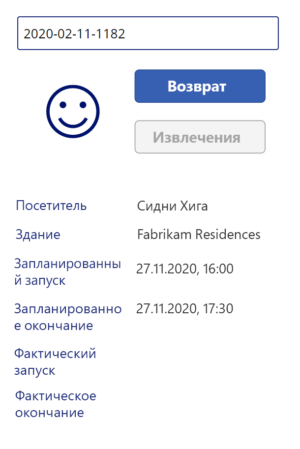

---
lab:
    title: 'Задание 3. Как создать приложение на основе холста, часть 2'
    module: 'Модуль 3. Начало работы с Power Apps'
---

# Модуль 3. Начало работы с Power Apps
## Задание 2. Как создать приложение на основе холста, часть 2

### Важное замечание (вступает в силу с ноября 2020 г.)
Платформа Common Data Service переименована в Microsoft Dataverse. В Microsoft Dataverse некоторые термины заменены. Например, теперь вместо «сущности» используется «таблица». «Поле» и «запись» заменены в базах данных Dataverse на «столбец» и «строку» соответственно.

Пока пользовательский интерфейс приложений находится в процессе обновления, могут встречаться устаревшие варианты некоторых терминов Microsoft Dataverse, например, «сущность» (теперь «**таблица**»), «поле» (теперь «**столбец**») и «запись» (теперь «**строка**»). Имейте это в виду при выполнении заданий. Мы рассчитываем в ближайшее время полностью обновить содержимое.  

Подробную информацию и полный список измененных терминов можно найти в разделе [Что такое Microsoft Dataverse?](https://docs.microsoft.com/ru-ru/powerapps/maker/common-data-service/data-platform-intro#terminology-updates)

# Сценарий

Bellows College — образовательное учреждение, имеющее на территории своего кампуса несколько зданий. Сейчас для регистрации посетителей кампуса используются бумажные журналы. Информация собирается несогласованно, отсутствуют средства сбора и анализа данных о визитах по всему кампусу. 

Администрация кампуса хотела бы модернизировать систему регистрации посетителей таким образом, чтобы допуск в здания контролировали сотрудники службы безопасности, а обитатели кампуса предварительно регистрировали все визиты и обязательно записывали их.

В этом курсе обучения вы разработаете приложения и реализуете автоматические процедуры, позволяющие администрации и службе охраны Bellows College контролировать доступ в здания кампуса. 

Во второй части этого задания вам предстоит разработать и создать приложение Power Apps на основе холста, с помощью которого охранники на входах в здание смогут быстро регистрировать посетителей и подтверждать их личность.

# Обзор этапов работы над высокоуровневым заданием

Этапы разработки приложения на основе холста

-   создание приложения в форм-факторе телефона;
-   подключение к источнику данных Dataverse;
-   сбор входных данных (кода посетителя) и поиск строки с данными посетителя;
-   настройка средства просмотра форм для отображения сведений о посетителе;
-   использование представления Dataverse для пополнения коллекции;
-   управление процессом регистрации прихода и ухода посетителя.

## Предварительные требования

* Выполнить **задание 0 модуля 0 «Проверка лабораторной среды»**.
* Выполнить **задание 1 модуля 2 «Введение в Microsoft Dataverse»**.

## Что необходимо знать перед началом работы?

-   К какой информации должны иметь быстрый доступ сотрудники охраны?
-   Что должно произойти, если код посетителя недействителен?
-   Что должно произойти, если посетитель не укладывается в запланированное время?

# Упражнение 1. Создание приложения для охраны на основе холста

**Цель упражнения.** В этом упражнении вы создадите приложение на основе холста.

## Задача 1. Создание приложения на основе холста

1.  Откройте свое решение «Управление кампусом».

    -   Войдите в систему на странице <https://make.powerapps.com>

    -   Если в верхней части экрана отображается среда, отличная от «Практика», выберите **свою среду**. 

    -   Нажмите **Решения**.

    -   Откройте свое решение **Управление кампусом**.
    
2.  Создание нового приложения на основе холста.

    -   Нажмите **Создать** и выберите **Приложение \| Приложение на основе холста \| Форм-фактор телефона**.
        В новом окне откроется редактор приложений.
        
    -   Если появится диалоговое окно с надписью «Добро пожаловать в Power Apps Studio», нажмите **Пропустить**.
    
3.  Сохраните приложение на основе холста.

    -   В меню **Файл** выберите команду **Сохранить как**.
    
    -   Проверьте, выбрано ли **Облако**. 
    
    -   Введите в поле «Имя» текст **[Ваша фамилия]: охрана кампуса** и нажмите **Сохранить**.
        
    -   Нажмите стрелку **Назад** в верхнем левом углу (под надписью Power Apps) для возврата к приложению.

3.  Подключитесь к источнику данных (таблицу «Визиты»).

    -   Выберите пункт меню **Представление \| Источники данных**.
    
    -   Нажмите **+ Добавить данные**.

    -   Нажмите **Просмотреть все сущности** (или таблицы)
    
    -   Выберите **Визиты** и дождитесь отображения таблицы визитов на вкладке «Данные».
    
4.  Для сохранения выполняемой работы выберите команду **Сохранить** в меню **Файл**. Нажмите кнопку со стрелкой назад, чтобы вернуться к приложению.

## Задача 2. Отображение сведений о посетителе

1.  Добавьте поле поиска.

    -   Выберите вкладку **Представление в виде дерева** на левой панели навигации.
    
    -   Выберите **Screen1**.
    
    -   Откройте вкладку **Вставка**.
    
    -   Нажмите **Текст** и выберите **Ввод текста**.
    
2.  Отредактируйте объект ввода текста.

    -   При выбранном объекте «Ввод текста» выберите текст в свойстве **По умолчанию** и очистите значение.
    
    -   Выберите свойство **Текст указания** и введите значение `Введите код посетителя` (включая двойные кавычки).
    
    -   Щелкните многоточие **...** рядом с именем элемента управления в дереве (TextInput1), выберите **Переименовать**, измените имя на `textCode`.
    
3.  Добавьте представление формы.

    -   На вкладке **Вставка** нажмите кнопку **Формы** и выберите **Отображение** (возможно, потребуется нажать кнопку со стрелкой вниз, расположенную в правой части ленты, чтобы увидеть эту кнопку).
   
    -   Перетащите форму в нужное положение, выравнивая ее с нижним краем экрана.
   
    -   Когда новая форма выбрана, выберите свойство **DataSource**, затем выберите **Визиты**.
   
    -   В поле **Макет** в области свойств выберите **Горизонтальный**.

4.  Отредактируйте представление формы.

    -   Когда новая форма выбрана, нажмите **Изменить поля**.

    -   Удалите поля **Имя** и **Время создания**.

    -   Нажмите **Добавить поле** и выберите следующие поля: **Фактическое окончание**, **Фактическое начало**, **Здание**, **Планируемое окончание**, **Планируемое начало**, **Посетитель**.
   
    -   Нажмите **Добавить**.
   
    -   Измените порядок полей, перетаскивая карточки полей в списке. Рекомендуемый порядок полей: «Посетитель», «Здание», «Планируемое начало», «Планируемое окончание», «Фактическое начало», «Фактическое окончание» (для облегчения перетаскивания полей их можно свернуть).
   
    -   Чтобы закрыть область полей, щелкните значок **X**.
   
5.  При выбранном представлении формы откройте вкладку «Расширенные» в области «Свойства». Выберите свойство **Элемент** и введите текст `LookUp(Visits, Code = textCode.Text)`. 

6.  Для сохранения выполняемой работы выберите команду **Сохранить** в меню **Файл**. Нажмите кнопку со стрелкой назад, чтобы вернуться к приложению.

7.  Подготовьте приложение к тестированию

    -   Перейдите на вкладку браузера, в которой открыто решение.

    -   Во всплывающем окне нажмите **Готово**.
   
    -   Выберите таблицу **Визит**.
   
    -   Перейдите на вкладку **Данные**.
   
    -   Откройте переключатель представлений в верхнем правом углу, щелкнув имя текущего представления **Активные визиты**.
   
    -   Перейдите к представлению **Все столбцы**.
   
    -   Найдите строку визита, в которой нет значений фактического начала или фактического окончания (т. е. оба столбца пустые). Выберите и скопируйте **код** этого визита.

8.  Тестирование приложения

    -   Для предварительного просмотра приложения перейдите на вкладку с приложением и нажмите **F5**, либо щелкните значок **Воспроизвести** в правом верхнем углу.
   
    -   Вставьте скопированное значение в текстовое поле поиска и проверьте отображение записи в форме.
   
9.  Очистите содержимое текстового поля поиска.
   
10.  Нажмите **ESC** для выхода из запущенного приложения.

## Задача 3. Добавление кнопок «Отметить приход» и «Отметить уход»

В этой задаче мы создадим кнопки, нажатием которых пользователь будет отмечать приход и уход в рамках визита. 

1. Сохраните результаты поиска в переменной, чтобы использовать их в элементах управления.

    * Выберите элемент управления **textCode**.
   
    * В области свойств выберите вкладку **Расширенные**, затем выберите свойство **OnChange**.
   
    * Введите выражение `Set(Visit, LookUp(Visits, Code = textCode.Text))`.
    
    > В результате визит сохраняется в глобальной переменной, когда пользователь выполняет поиск в поле textCode. Это позволяет использовать переменную *Визит* в любом месте приложения без необходимости повторного ввода всего выражения для поиска.

2. Добавьте кнопку «Отметить приход»

   * Выберите вкладку **Вставка**.
   
   * Нажмите **Кнопка**.
   
   * В области свойств измените свойство кнопки **Текст** на `Отметить приход` (можно вводить символы внутри существующих кавычек).
   
   * Щелкните многоточие **...** рядом с именем кнопки в дереве (Button1), выберите **Переименовать** и измените имя на `CheckInButton`.

3. Добавьте кнопку «Отметить уход»   

   * Чтобы добавить еще одну кнопку, нажмите **Кнопка** на панели «Вставка».
   
   * В области свойств измените свойство кнопки **Текст** на `Отметить уход` (можно вводить символы внутри существующих кавычек).
   
   * Переименуйте кнопку, введя `CheckOutButton`
   
   * Расположите кнопки под строкой поиска, кнопку **Отметить приход** над кнопкой **Отметить уход**. 
   
## Задача 4. Включение и отключение кнопок в зависимости от данных визита

Мы хотим, чтобы после просмотра записи о визите пользователь зарегистрировал приход в рамках данного визита нажатием кнопки «Отметить приход». Нам нужно включать кнопку **Отметить приход**, когда найдена непустая запись о визите, ее состояние активно, а визит пока не начат, т. е. значение фактического начала пусто.

1. Выберите **Кнопку прихода** и на панели свойств щелкните свойство кнопки **Режим отображения**.

2. Введите в поле функции следующее выражение:

      ```
      If(!IsBlank(Visit) 
      && Visit.Status = 'Status (Visits)'.Active
      && IsBlank(Visit.'Actual Start'),
          DisplayMode.Edit,
          DisplayMode.Disabled
      )
      ```

   Это выражение состоит из следующих частей:

   * **!IsBlank(Visit)** - запись о визите найдена
   * **&&** - логический оператор И
   * **Visit.Status = 'Status (Visits)'.Active** состояние записи — *активна*
   * **IsBlank(Visit.'Actual Start')** - в поле «Фактическое начало» нет данных
   * **DisplayMode.Edit, DisplayMode.Disabled** - если приведенные выше условия выполняются, кнопка доступна для изменения. В противном случае кнопка будет отключена.

Нам нужно включать кнопку **Отметить уход**, когда найдена непустая запись о визите, ее состояние активно, а визит уже начался, т. е. значение фактического начала не пусто.

3. Выберите кнопку «Отметить уход» и на панели свойств щелкните свойство кнопки **Режим отображения**.

4. Введите в поле функции следующее выражение:

     ```
     If(!IsBlank(Visit) 
     && Visit.Status = 'Status (Visits)'.Active
     && !IsBlank(Visit.'Actual Start'),
         DisplayMode.Edit,
         DisplayMode.Disabled
     )
     ```

5. Для сохранения выполняемой работы выберите команду **Сохранить** в меню **Файл**. Нажмите кнопку со стрелкой назад, чтобы вернуться к приложению.

6. Нажмите клавишу **F5** для запуска приложения. 

7. Обе кнопки должны быть отключены. Введите скопированное ранее значение кода и нажмите клавишу **Tab**, чтобы убрать выделение с текстового поля (или щелкните мышью вне текстового поля). Кнопка **Отметить приход** должна включиться. 

8. Очистите содержимое поля поиска.

9. Нажмите **ESC** для выхода из запущенного приложения.

## Задача 5. Выполнение процесса регистрации прихода и ухода

Для выполнения регистрации прихода и ухода необходимо изменить данные визита в базе Dataverse следующим образом.

* Когда посетитель отмечает приход, записать в поле *Фактическое начало* текущие значения даты и времени.
* Когда посетитель отмечает уход, записать в поле *Фактическое окончание* текущие значения даты и времени. 
* После регистрации ухода изменить состояние записи на неактивное, указывающее на окончание визита.

1. Выберите кнопку **Отметить приход**.

2. На вкладке «Расширенные» введите в поле свойства **OnSelect** следующее выражение:

   ```
   Patch(
       Visits,
       Visit,
       {'Actual Start': Now()}
   );
   Refresh([@Visits]);
   Set(Visit, LookUp(Visits, Code = textCode.Text));
   ```

   Это выражение состоит из следующих частей:

   * **Patch(Visits, Visit, {'Actual Start': Now()});**. Метод *Patch* изменяет в таблице **Visits** строку, на которую указывает переменная **Visit** (соответствующая текущему визиту). Данное выражение записывает в столбец *Actual Start* текущую дату и текущее время (метод *Now()*).
   * **Refresh([@Visits]);**. Это выражение обновляет строки визита после изменения значений.
   * **Set(Visit, LookUp(Visits, Code = textCode.Text));** это выражение обновляет переменную *Visit* новыми данными из базы Dataverse.
   
   > Когда пользователь нажимает эту кнопку, для фактического начала визита записываются текущие значения даты и времени, после чего данные обновляются.

3. Выберите кнопку **Отметить уход**.

4. На вкладке «Расширенные» введите в поле свойства **OnSelect** следующее выражение:

   ```
   Patch(
       [@Visits],
       Visit,
       {
           'Actual End': Now(),
           Status: 'Status (Visits)'.Inactive
       }
   );
   Refresh([@Visits]);
   Set(Visit, LookUp(Visits, Code = textCode.Text));
   ```

   Когда пользователь нажимает эту кнопку, для фактического окончания визита записываются текущие значения даты и времени, визит переводится в неактивное состояние, после чего данные обновляются.

5. Для сохранения выполняемой работы выберите команду **Сохранить** в меню **Файл**. Нажмите кнопку со стрелкой **Назад**, чтобы вернуться к приложению.

6. Нажмите клавишу **F5** или кнопку «Воспроизвести» для запуска приложения. Введите скопированное ранее значение кода и нажмите клавишу **Tab**, чтобы убрать выделение с текстового поля. Кнопка **Отметить приход** должна включиться.

7. Нажмите кнопку **Отметить приход**. Должно произойти следующее:

   * В поле **Фактическое начало** записываются текущие значения даты и времени.
   
   * Кнопка **Отметить приход** отключается.
   
   * Кнопка **Отметить уход** включается.

8. Нажмите кнопку **Отметить уход**.

   * В поле **Фактическое окончание** записываются текущие значения даты и времени.
   
   * Обе кнопки отключаются.

9. Очистите содержимое поля поиска.

10. Нажмите **ESC** для выхода из запущенного приложения.

## Задача 6. Добавление визуальных индикаторов

При наличии визуальных индикаторов пользоваться мобильным приложением гораздо удобнее. В этой задаче мы добавим значок, указывающий на возможность регистрации прихода или ухода посетителя.

1. Выберите вкладку **Вставка**.

2. Выберите **Значки \| Добавить**. Выберите какой-либо значок. На этом шаге не важно, какой именно выбрать значок, поскольку нам нужно сделать значение динамическим.

3. Измените размер значка и поместите его слева от кнопок.

4. На вкладке «Расширенные» данного значка выберите свойство **Значок** (в разделе конструктора) и введите следующее выражение:

   ```
   If(
      CheckInButton.DisplayMode = DisplayMode.Disabled 
   && CheckOutButton.DisplayMode = DisplayMode.Disabled,
       Icon.EmojiFrown,
       Icon.EmojiSmile
   )
   ```

5. Для сохранения выполняемой работы выберите команду **Сохранить** в меню **Файл**. Нажмите кнопку со стрелкой **Назад**, чтобы вернуться к приложению.

6. Нажмите клавишу **F5** для запуска приложения. Введите скопированное ранее значение кода и нажмите клавишу **Tab**, чтобы убрать выделение с текстового поля. Убедитесь, что на месте значка отображается хмурый смайлик.

7. Найдите другое значение кода, не использовавшееся ранее (для которого нет значений фактического начала или фактического окончания визита). 

    > Вы можете вернуться к предыдущей вкладке и скопировать другой код из одного из созданных вами визитов. Можно также запустить созданное ранее приложение **Персонал кампуса** и создать новые записи визитов. Убедитесь, что для этого кода на месте значка отображается улыбающийся смайлик.

Работающее приложение должно выглядеть примерно так:



8. Нажмите **ESC** для выхода из запущенного приложения.

## Задача 7. Публикация приложения

1. Приложение «Охрана кампуса» должно быть открыто в браузере. Если это не так, выберите приложение **Охрана кампуса** и нажмите кнопку **Правка**.

2. Выберите пункт меню **Файл \| Опубликовать** 

3. Нажмите **Опубликовать эту версию**.

# Задачи повышенной сложности

* Откажитесь от ручного ввода кода визита.
* Добавьте проверку здания для визита.
* Добавьте проверку соответствия фактического и запланированного времени визита (слишком рано, опоздание и т. д.).
* Добавьте подробные сведения о визите, например отображение адреса электронной почты и подтверждение личности посетителя, причину отказа в доступе в здание и т. д.
* Обеспечьте возможность назначения нескольких зданий, собраний или регистраций прихода для одного и того же визита в кампус. Например, кто-то может прийти в кампус на целый день и в течение этого дня встречаться с местным персоналом в нескольких зданиях в разное время. Попробуйте добавить в решение сущность *встреча*.
