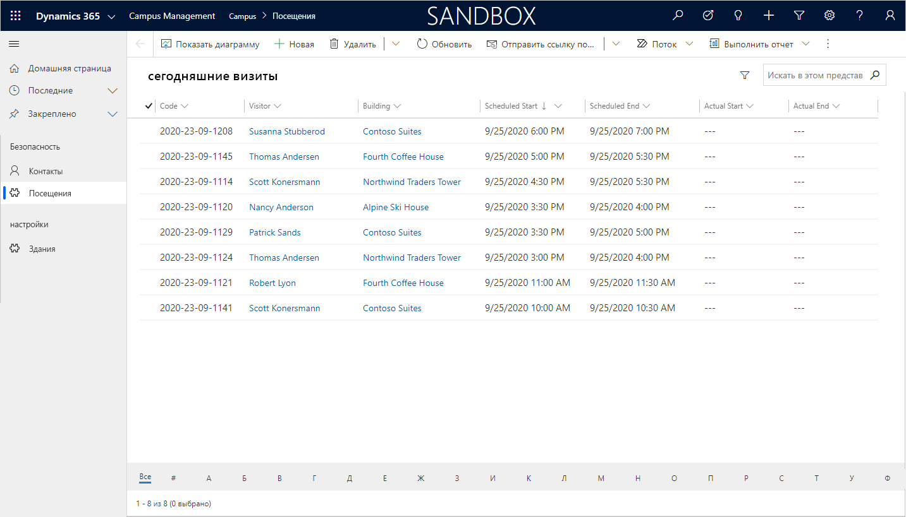

---
lab:
    title: 'Лабораторная работа 4. Как создать приложение на основе модели?'
    module: 'Модуль 3. Начало работы с Power Apps'
---

# Модуль 3. Начало работы с Power Apps
## Лабораторная работа 3. Как создать приложение на основе модели?

### Важное замечание (вступает в силу с ноября 2020 г.)
Платформа Common Data Service переименована в Microsoft Dataverse. В Microsoft Dataverse некоторые термины заменены. Например, сущность (now **таблица**), поле (now **столбец**) и запись (now **строка**) могут устареть. Имейте это в виду при выполнении заданий. Мы рассчитываем в ближайшее время полностью обновить содержимое.

Подробную информацию и полный список измененных терминов можно найти в разделе [Что такое Microsoft Dataverse?](https://docs.microsoft.com/ru-ru/powerapps/maker/common-data-service/data-platform-intro#terminology-updates)

# Сценарий

Bellows College — образовательное учреждение, имеющее на территории своего кампуса несколько зданий. Сейчас для регистрации посетителей кампуса используются бумажные журналы. Информация собирается несогласованно, отсутствуют средства сбора и анализа данных о визитах по всему кампусу. 

Администрация кампуса хотела бы модернизировать систему регистрации посетителей таким образом, чтобы допуск в здания контролировали сотрудники службы безопасности, а обитатели кампуса предварительно регистрировали все визиты и обязательно записывали их.

В этом курсе обучения вы разработаете приложения и реализуете автоматические процедуры, позволяющие администрации и службе охраны Bellows College контролировать доступ в здания кампуса. 

В этом задании вам предстоит создать приложение Power Apps на основе модели, чтобы обеспечить служебному персоналу возможность управлять записями о посещениях всего кампуса.

# Обзор этапов работы над общим заданием

Создание приложение на основе модели состоит из следующих этапов:

-   создание нового приложения на основе модели под именем «Управление кампусом»;

-   редактирование элементов навигации приложения для связи с необходимыми таблицами;

-   настройка форм и представлений таблиц, необходимых для приложения.

Мы будем работать со следующими компонентами.

- **Представления**: представления позволяют пользователю отображать существующие данные в табличной форме.

- **Формы**: здесь пользователь создает новые строки в таблицах или обновляет их.

Оба компонента интегрируются в приложение на основе модели, чтобы улучшить взаимодействие с пользователем.

## Предварительные требования

* Выполнить **лабораторную работу 0 модуля 0 «Проверка лабораторной среды»**.
* Выполнить **лабораторную работу 1 модуля 2 «Введение в Microsoft Dataverse»**.

## Что необходимо учитывать перед началом работы?

-   Какие изменения следует внести, чтобы улучшить взаимодействие с пользователем?

-   Что необходимо включить в приложение на основе модели в зависимости от созданной нами модели данных?
    
-   Как можно настроить карту сайта для приложения на основе модели?

# Упражнение 1. Настройка представлений и форм

**Назначение:** В этом упражнении вы настроите представления и формы для созданных ранее таблиц и сможете использовать их в приложении на основе модели.

## Задача 1. Редактирование формы для визита

1.  Войдите в систему на странице <https://make.powerapps.com> (если это не сделано ранее)

2.  Выберите свою **среду**.

3.  Нажмите **Решения**.

4.  Откройте свое решение **Управление кампусом**.

5.  Откройте сущность **Визит**.

6.  Перейдите на вкладку **Формы** и откройте тип формы **Основная форма**. 

    > По умолчанию в форме имеется два поля: «Имя» (основное поле) и «Владелец».
    
7.  Нажмите **+ Поле формы** и добавьте под полем **Владелец** следующие поля, перетаскивая столбцы в форму или просто щелкая заголовки столбцов:

    * **«Здание»;**
    * **«Посетитель»;**
    * **«Планируемое начало»;**
    * **«Планируемое окончание».**
    * **«Фактическое начало»;**
    * **«Фактическое окончание».** 
    
8.  Перетащите столбец **Код** в заголовок формы. 

    > Заголовок — это верхняя правая область формы. Возможно, вам придется свернуть панель «Свойства» в правой части экрана, чтобы увидеть поле в форме.

9.  Не снимая выделения с поля **Код**, установите флажок **Только для чтения** на панели «Свойства».

10.  Выберите поле **Владелец**. На панели «Свойства» измените **метку поля** на **Организатор**.

11.  Нажмите **Сохранить** в правом верхнем углу и дождитесь завершения сохранения.

12.  Нажмите кнопку **Опубликовать** в правом верхнем углу и дождитесь завершения публикации.

13.  Нажмите кнопку **Назад** в левом верхнем углу экрана. После этого вы должны вернуться на
     вкладку форм для сущности «Визит».

## Задача 2. Редактирование представлений для визита

В этой задаче мы изменим представление «Активные визиты» по умолчанию и создадим новое представление для визитов текущего дня.

1.  Выберите вкладку **Представления** и откройте представление **Активные визиты**.

2.  Щелчком мыши или перетаскиванием добавьте в представление следующие поля:

    *  **«Код»;**
    *  **«Посетитель»;**
    *  **«Здание»;**
    *  **«Планируемое начало»;** 
    *  **«Планируемое окончание».**
    
3.  Выберите столбец **Время создания** и нажмите **Удалить**. Поле **Время создания** будет удалено из представления.

4.  Выберите столбец **Имя** и нажмите **Удалить**. Поле **Имя** будет удалено из представления.

5.  На панели «Свойства» справа нажмите **Сортировать по…** и выберите **Планируемое начало**. Еще раз щелкните заголовок **Планируемое начало**, чтобы установить сортировку по убыванию.

6.  Измените ширину отдельных столбцов, чтобы в них умещались данные.

7.  Нажмите **Сохранить** и дождитесь сохранения изменений.

8.  Нажмите **Опубликовать** и дождитесь завершения публикации.

Теперь мы клонируем это представление, чтобы создать новое представление для визитов текущего дня.

9.  На панели свойств перейдите по ссылке **Изменить фильтры**.

10.  Нажмите **Добавить** и выберите **Добавить строку**.

11.  Выберите поле **Планируемое начало**, затем в раскрывающемся списке выберите условие **Сегодня**. 

12.  Нажмите многоточие **[...]** в строке **Состояние** и выберите **Удалить**. 

13.  Для сохранения условия нажмите **OK**. Теперь представление отфильтровано и будет отображать только записи, в которых дата начала запланирована на сегодня.

14.  Добавьте в представление поля **Фактическое начало** и **Фактическое окончание**. 

    > **Примечание.** Поскольку фильтр по состоянию представления не работает, мы увидим все сегодняшние визиты, в том числе завершенные. Эти поля помогут отделить завершенные визиты от текущих.

15.  Нажмите **стрелку раскрывающегося списка** рядом с кнопкой «Сохранить» (будьте осторожны, не нажимайте саму кнопку) и выберите команду **Сохранить как**.

16.  Измените имя на **Сегодняшние визиты** и нажмите **Сохранить**.

17.  Нажмите **Опубликовать** и дождитесь завершения публикации.

# Упражнение 2. Создание приложения на основе модели

**Назначение:** В этом упражнении вы создадите приложение на основе модели, настроите карту сайта и протестируете приложение.

> Вы увидите несколько полей, которые не были добавлены при создании вашего приложения, в частности на этапах настройки карты сайта. Для выполнения заданий мы использовали некоторые сокращения. В реальных условиях следует присвоить этим элементам осмысленные имена.

## Задача 1. Создание приложения

1.  Откройте свое решение «Управление кампусом», если это еще не сделано.

    -   Войдите в систему на странице <https://make.powerapps.com>

    -   Находясь в своей среде, откройте решение **Управление кампусом**.
        .
    
2.  Создайте приложение на основе модели.

    -   Нажмите **Создать** и выберите **Приложение**, затем — **Приложение на основе модели**. В результате откроется новая вкладка.
    
    -   В поле «Имя» введите строку **[Ваша фамилия]: управление кампусом**.

    -   Установите флажок **Использовать существующее решение для создания приложения**.

    -   Нажмите **Далее**.

    -   Выберите свое решение **Управление кампусом**.
    
    -   Нажмите **Готово**.
    
3.  Щелкните значок карандаша рядом с **картой сайта**.

4.  Отредактируйте заголовки по умолчанию.

    -   Выберите **Создать область**.

    -   Измените заголовок новой области на **Кампус** в области свойств справа.

    -   Выберите **Создать группу**.

    -   Измените заголовок новой группы на **Охрана** в области свойств справа.
    
5.  Добавьте таблицу контактов в карту сайта

    -   Выберите **Создать дочернюю область**.

    -   В области **Свойства** выберите **Сущность** в раскрывающемся списке
        **Тип**.

    -   Найдите таблицу **Контакт** в раскрывающемся списке для **сущности**.
    
6.  Добавьте таблицу визитов в карту сайта.

    -   Выберите группу **Охрана** и нажмите кнопку **Добавить**.

    -   Выберите **дочернюю область**.

    -   Перейдите в область **Свойства**.

    -   В раскрывающемся списке **Тип** выберите **Сущность** и найдите
        таблицу **Визит** в раскрывающемся списке для **сущности**.
    
7.  Добавьте таблицу зданий в карту сайта.

    -   Выберите область **Кампус** и нажмите **Добавить**.
    
    -   Выберите **Группа**.
    
    -   Введите слово **Параметры** в **Заголовок** в области **Свойства**.
    
    -   Не снимая выделения с области **Параметры**, нажмите **Добавить**.
    
    -   Выберите **дочернюю область**.
    
    -   Перейдите в область **Свойства**.
    
    -   В раскрывающемся списке **Тип** выберите **Сущность** и найдите таблицу **зданий** в раскрывающемся списке для **сущности**.

8.  Нажмите **Сохранить**. Пока изменения сохраняются, будет отображаться экран загрузки.

9.  Для публикации карты сайта нажмите **Опубликовать** и дождитесь завершения публикации.

10.  Нажмите **Сохранить и закрыть**, чтобы закрыть редактор карты сайта. 

    > Вы увидите, что компоненты для объектов, добавленных в карту сайта, теперь включены в приложение.
     
11.  Нажмите **Сохранить** в конструкторе приложений.

12.  Чтобы проверить изменения, внесенные в приложение, нажмите кнопку **Проверить**. 

    >  При этом отобразятся некоторые предупреждения, но их можно игнорировать, так как мы не ссылались на конкретное представление и форму для объектов, и пользователи будут иметь доступ ко всем представлениям и формам для объектов **Визит** и **Здание**.
     
13. Нажмите **Опубликовать**.

14.  Нажмите **Сохранить и закрыть**, чтобы закрыть конструктор приложений.

15.  Нажмите **Готово**.

16.  Выберите **Решения**, затем выберите **Опубликовать все настройки**.

17.  Выберите **Приложения** и убедитесь в наличии своего приложения в списке.

## Задача 2. Тестирование приложения

1.  Запустите приложение

    -   Выберите **Приложения** и щелкните свое приложение **Управление кампусом**. (Если вы не видите свое приложение, вам может потребоваться обновить страницу в браузере.)

    -   Приложение должно открыться в новом окне.
    
2.  Создайте новый контакт.

    -   Приложение должно открыться в представлении **Активные контакты**.

    -   Выберите пункт **Создать** в верхнем меню.

    -   В поле **Имя** введите `John`, в поле **Фамилия** — `Doe`.

    -   В поле **Email** укажите свой личный адрес электронной почты. Он будет использован в одном из заданий позже. 
    
    -   Нажмите **Сохранить и закрыть**.

    -   После этого созданный контакт должен отобразиться в представлении **Активные контакты**.
    
3.  Создайте новое здание.

    -   Выберите **Здания** на карте сайта.

    -   Нажмите **Создать**.

    -   В поле **Имя** введите `Microsoft Building`.
        
    -   Нажмите **Сохранить и закрыть**. В результате вновь созданная запись отобразится
        в представлении «Активные здания».
    
4.  Создайте новый визит.

    -   Выберите **Визиты** на карте сайта.
    
    -   Нажмите **Создать**.
    
    -   Введите следующие поля: 
    
        -   **Имя**: `New test visit`
        -   **Здание**: выберите здание Майкрософт
        -   **Посетитель**: Выберите Александра Демидова
        -   **Планируемое начало**: выберите завтрашнее число и время начала 14:00
        -   **Планируемое окончание**: выберите завтрашнее число и время окончания 15:30
        
    -   Нажмите **Сохранить и закрыть**. В результате будет создан визит, и вы должны увидеть его в
        представлении «Активные визиты».
        
    -   Перейдите к представлению **Сегодняшние визиты**. В этом представлении новый визит отображаться не должен, так как он запланирован на завтра.
    
5. Вы можете добавить еще несколько тестовых записей.

   Работающее приложение должно выглядеть примерно так:

# Задачи повышенной сложности

* Выберите особые представления и формы для визитов и зданий.
* Сотрудники охраны обычно работают в одном здании. Как обеспечить им простой способ просматривать визиты только для выбранного здания?
* Ограничьте доступ к определенным объектам, например, здания должны быть доступны только для чтения для всех сотрудников, кроме администраторов.
* Какие панели мониторинга вы бы предложили для добавления в приложение?
