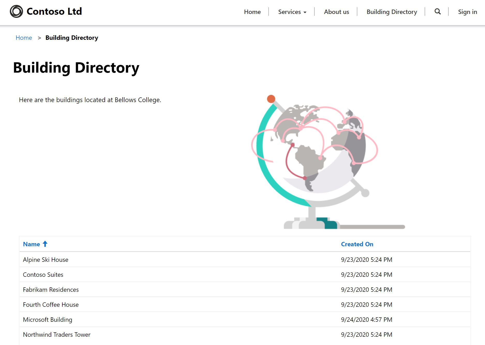

---
lab:
    title: 'Задание 5. Как создать портал Power Apps?'
    module: 'Модуль 3. Начало работы с Power Apps'
---

# Модуль 3. Начало работы с Power Apps

## Задание 4. Как создать портал Power Apps?

### Важное замечание (вступает в силу с ноября 2020 г.)
Платформа Common Data Service переименована в Microsoft Dataverse. В Microsoft Dataverse некоторые термины заменены. Например, теперь вместо «сущности» используется «таблица». «Поле» и «запись» заменены в базах данных Dataverse на «столбец» и «строку» соответственно.

Пока пользовательский интерфейс приложений находится в процессе обновления, могут встречаться устаревшие варианты некоторых терминов Microsoft Dataverse, например, «сущность» (теперь «**таблица**»), «поле» (теперь «**столбец**») и «запись» (теперь «**строка**»). Имейте это в виду при выполнении заданий. Мы рассчитываем в ближайшее время полностью обновить содержимое. 

Подробную информацию и полный список измененных терминов можно найти в разделе [Что такое Microsoft Dataverse?](https://docs.microsoft.com/ru-ru/powerapps/maker/common-data-service/data-platform-intro#terminology-updates)

# Сценарий

Bellows College — образовательное учреждение, имеющее на территории своего кампуса несколько зданий. Сейчас для регистрации посетителей кампуса используются бумажные журналы. Информация собирается несогласованно, отсутствуют средства сбора и анализа данных о визитах по всему кампусу.

Администрация кампуса хотела бы предоставить посетителям информацию о зданиях на территории кампуса. Посетители увидят список зданий на веб-сайте, который будет создан с использованием портала Power Apps.

В этом задании вам предстоит подготовить к работе портал Power Apps и создать веб-страницу порталов, на которой будет показан список зданий на территории кампуса.

# Обзор этапов работы над высокоуровневым заданием

План разработки портала Power Apps

* Подготовка портала Power Apps в среде Dataverse.
* Создание и настройка веб-страницы для отображения списка зданий.
* Создание новой темы и ее применение к порталу.

## Предварительные требования

* Выполнить **задание 0 модуля 0 «Проверка лабораторной среды»**.
* Выполнить **задание 1 модуля 2 «Введение в Microsoft Dataverse»**.

## Что необходимо знать перед началом работы?

* Приложения порталов Power Apps всегда создаются из шаблона, а не из пустого приложения. Ваш портал должен быть создан в ходе задания 0 модуля 0. После подготовки портала к работе в нем уже будут страницы, меню и тема по умолчанию. 

# Упражнение 1. Создание веб-страницы портала

**Цель упражнения.** В этом упражнении вы создадите новую веб-страницу, на которой будут отображаться некое статическое содержимое и список зданий из базы данных Dataverse.

## Задача 1. Перейдите к порталу

1.  Перейдите по ссылке <https://make.powerapps.com>.

2.  Убедитесь, что вы находитесь в своей среде «Практика». Если это не так, измените среду в правом верхнем углу экрана.

3.  Щелкните **Приложения**.

4.  Найдите приложение, имеющее **тип** **Портал**.

5.  Для открытия портала щелкните имя приложения.

    > Вы должны попасть на целевую страницу веб-сайта своего портала с приветственным сообщением. Перейдите на свой портал, чтобы увидеть компоненты, созданные по умолчанию при подготовке портала к работе. 

## Задача 2. Создание веб-страницы

1.  Откройте редактор порталов Power Apps Studio

    -   Войдите в систему на странице <https://make.powerapps.com> (возможно, она уже открыта в одной из вкладок).

    -   Выберите **Приложения**.
    
    -   Найдите приложение, имеющее **тип** **Портал**.

    -   Нажмите многоточие (**…**) справа от имени приложения порталов и выберите **Изменить**.

    > Теперь вы находитесь в редакторе порталов Power Apps Studio. Здесь вы можете изменять и создавать содержимое портала.

2.  Создайте новую страницу.

    -   На панели команд выберите **Новая страница**.

    -   Наведите указатель мыши на **фиксированные макеты** и выберите **Страница с заголовком**.

3.  В области свойств в разделе **Отображение** измените **Имя** с **Новая страница (1)** на `Building Directory`.

4.  В поле **Часть URL-адреса** измените значение на `building-directory` и нажмите клавишу Tab, чтобы инициировать автосохранение.

    > После этого в заголовке страницы должна появиться строка **Каталог зданий**.
    
## Задача 3. Добавление статического содержимого

1.  Добавьте раздел в веб-страницу.

    -   На холсте (в области отображения веб-страницы) выберите раздел **Копия страницы**. Это большая рамка вокруг двух предложений текста в середине вашей страницы.

    -   На панели инструментов (слева) выберите значок **Компоненты**.

    -   В области **Макет раздела** выберите **Раздел с двумя столбцами**.

2.  Добавьте статический текст.

    -   На холсте (в области отображения веб-страницы) выберите левый столбец.

    -   На панели инструментов (слева) выберите значок **Компоненты**.

    -   В области **Компоненты портала** выберите **Текст**.

    -   В новом текстовом поле введите следующий текст:
          ```
> Ниже следует каталог зданий.
          ```
    -   Чтобы удалить текст по умолчанию, выберите текстовое поле над только что отредактированным полем и нажмите **Удалить** на панели команд.

3. Добавьте изображение.

    -   На холсте (в области отображения веб-страницы) выберите правый столбец.

    -   На панели инструментов (слева) выберите значок **Компоненты**.

    -   В области **Компоненты портала** выберите **Изображение**.

    -   В области свойств нажмите **Выбрать изображение**. Найдите и выберите файл **Product A.png**.
    
    -   В области свойств щелкните раскрывающийся список раздела **Форматирование** и введите в поле **Ширина** значение 70% (обязательно введите знак «%»). Пробуя вводить разные значения, установите желаемый размер изображения.

4.  Чтобы увидеть текущее состояние страницы, нажмите **Просмотр веб-сайта**.  Обратите внимание, что в главном меню появился параметр **Каталог зданий**.

    > Возможно, вам потребуется разрешить в браузере показ всплывающих окон.

## Задача 4. Добавление списка компонентов

1.  Вернитесь на предыдущую вкладку и перейдите к шагу 2. Если вкладка недоступна, выполните следующие действия, чтобы вернуться к этому этапу.

    -   Войдите в систему на странице <https://make.powerapps.com> (возможно, она уже открыта в одной из вкладок).

    -   Найдите приложение, имеющее **тип** **Портал**.

    -   Нажмите многоточие (**…**) и выберите **Изменить**.
    
    -   На панели инструментов (слева) выберите вариант **Страницы**. 

    -   Найдите и выберите созданную ранее страницу **Каталог зданий**.
    
2.  Добавьте список компонентов на страницу каталога зданий

    -   Выберите раздел с двумя столбцами.

    -   На панели инструментов (слева) выберите значок **Компоненты**.

    -   В области **Макет раздела** выберите **Раздел с одним столбцом** (раздел появится под изображением и текстом на веб-странице).

    -   На холсте выберите новый раздел со столбцом.

    -   На панели инструментов (слева) выберите значок **Компоненты**.

    -   В области **Компоненты портала** выберите **Список** (компонент-список появится в новом разделе).
    
3.  Настройте компонент списка

    -   На холсте выберите компонент списка.

    -   В области свойств (справа) введите в поле **Имя** текст `Buildings List`.

    -   Из раскрывающегося списка в поле **Таблица** выберите **Здание (bc_building)**.

    -   В поле **Представления** выберите **Активные здания**.

    -   В остальных настройках оставьте значения по умолчанию.
    
4.  Чтобы увидеть страницу, нажмите **Просмотр веб-сайта**. 

    > На веб-странице должен появиться список зданий из вашей базы данных Dataverse.

# Упражнение 2. Изменение темы портала

**Цель упражнения.** В этом упражнении вы создадите новую тему, которая изменит цветовую схему вашего портала. 

## Задача 1. Применение и редактирование темы

1.  Вернитесь на предыдущую вкладку и перейдите к шагу 2. Если вкладка недоступна, выполните следующие действия, чтобы вернуться к этому этапу.

    -   Войдите в систему на странице <https://make.powerapps.com> (возможно, она уже открыта в одной из вкладок).

    -   Найдите приложение, имеющее **тип** **Портал**.

    -   Нажмите многоточие (**…**) и выберите **Изменить**.
    
2.  Примените и настройте базовую тему.

    -   На панели инструментов (слева) выберите значок **Темы**.
    
    -   Чтобы включить эту функцию, щелкните переключатель **Включить базовую тему**.
    
    -   Нажмите многоточие (**…**) рядом с одной из готовых настроек и выберите **Настроить**.
    
    -   В результате будет создана копия базовой темы. 
    
    -   Попробуйте менять цвета в области свойств и оцените влияние этих изменений на ваш портал.
    
    -   Переименуйте свою тему.
    
3.  На панели команд нажмите **Синхронизировать конфигурацию**.

Макет вашего приложения должен выглядеть примерно так:



# Задачи повышенной сложности

* Создайте другое представление зданий, в котором отображается только название здания. Чтобы увидеть изменения, вам потребуется выбрать **Просмотр веб-сайта** в редакторе порталов Studio.
* На панели инструментов щелкните значок **Темы** и отредактируйте таблицу CSS настроенной вами темы.
* Создайте страницу с компонентом **Форма** и измените компонент **Список**, чтобы добавлять или изменять строки Dataverse, используя форму.
* В области **настроек** компонента **Список** включите **Разрешения сущности**. Что происходит с данными?
* В редакторе порталов Studio щелкните значок редактора исходного кода `</>`, чтобы просмотреть исходный код страницы. Если вам знаком язык HTML, внесите какие-либо изменения и просмотрите результаты.
