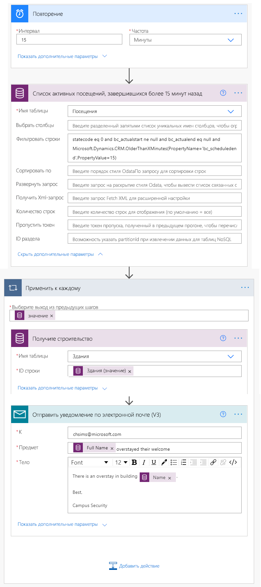

---
lab:
    title: 'Лабораторная работа 6. Как создать автоматизированное решение?'
    module: 'Модуль 4. Начало работы с Power Automate'
---

# Модуль 4. Начало работы с Power Automate
## Лабораторная работа. Как создать автоматизированное решение?

## Сценарий

Bellows College — образовательное учреждение, имеющее на территории своего кампуса несколько зданий. Сейчас для регистрации посетителей кампуса используются бумажные журналы. Информация собирается несогласованно, отсутствуют средства сбора и анализа данных о визитах по всему кампусу. 

Администрация кампуса хотела бы модернизировать систему регистрации посетителей таким образом, чтобы допуск в здания контролировали сотрудники службы безопасности, а обитатели кампуса предварительно регистрировали все визиты и обязательно записывали их.

В этом курсе обучения вы разработаете приложения и реализуете автоматические процедуры, позволяющие администрации и службе охраны Bellows College контролировать доступ в здания кампуса. 

В этом задании вам предстоит создать потоки Power Automate для автоматизации ряда аспектов управления кампусом. 

# Обзор этапов работы над общим заданием

Для выполнения проекта необходимо выполнить следующие требования.

* Перед визитом каждый посетитель должен получить присвоенный ему уникальный код.
* Персонал охраны должен получать уведомления о посетителях, превысивших предоставленное им время для визита.

## Предварительные требования

* Выполнить **лабораторную работу 0 модуля 0 «Проверка лабораторной среды»**.
* Выполнить **лабораторную работу 1 модуля 2 «Введение в Microsoft Dataverse»**.
* Создать приложение «Персонал кампуса» в **лабораторной работе 2 модуля 3 «Как создать приложение на основе холста, часть 2»** (для тестирования).
* Создать контакт «Александр Демидов» с личным адресом электронной почты в **лабораторной работе 4 модуля 3 «Как создать приложение на основе модели?»** (для тестирования).

## Что необходимо знать перед началом работы?

-   Выберите наиболее подходящий механизм распределения кодов посетителей.
-   Как можно измерить превышение длительности визита и обеспечить соблюдение строгих правил?

# Упражнение 1. Создание потока уведомлений о визитах

**Назначение:** В этом упражнении вы создадите поток Power Automate, который реализует данное требование. Посетителю необходимо отправить электронное письмо с уникальным кодом, присвоенным визиту.

## Задача 1. Создание потока

1.  Откройте свое решение «Управление кампусом».

    -   Войдите в систему на странице <https://make.powerapps.com>

    -   Выберите свою **среду**.

    -   Нажмите **Решения**.

    -   Откройте свое решение **Управление кампусом**.

2.  Нажмите **Создать** и выберите **Служба автоматизации**, **Облачный поток**, а затем — **Автоматический**. В новом окне откроется редактор потока Power Automate.

3. В разделе **Выбор триггера потока** найдите **Microsoft Dataverse**.

4. Выберите триггер **При добавлении, изменении или удалении строки**, а затем нажмите **Создать**.

   * В поле **Тип изменения** выберите **Добавлено**.
   
   * В поле **Имя таблицы** выберите **Визиты**.
   
   * В поле **Область действия** выберите **Организация**.
   
   * Для настройки шага триггера нажмите многоточие (**...**), затем **Переименовать**. Введите для этого триггера новое имя **При добавлении визита**. Это позволит вам и другим редакторам потока понять назначение шага без изучения подробностей.

5. Выберите **Новый шаг**. Этот шаг необходим для получения сведений о посетителях, включающих адрес электронной почты.

6. Найдите словосочетание **Microsoft Dataverse**.

7. Выберите действие **Выбрать строку по идентификатору**. 

   * В поле **Имя таблицы** введите **Контакты**.
   
   * В поле **Идентификатор строки** выберите **Посетитель (значение)** из списка динамического содержимого.
   
   * В определении этого действия нажмите многоточие (**...**), затем **Переименовать**. Введите новое имя этого действия **«Выбрать посетителя»**. Это позволит вам и другим редакторам потока понять назначение шага без изучения подробностей.

8. Нажмите **Новый шаг**. Это шаг предназначен для создания и отправки посетителю электронного письма.

9. Найдите слово *почта*, выберите соединитель **Office 365 Outlook** и действие **Отправить уведомление по электронной почте (V2)**.

   * Если появится запрос на принятие условий использования этого действия, нажмите кнопку **Принять**.
   
   * Выберите поле **Кому** и значение **Email** из списка динамического содержимого. Обратите внимание, что он находится под заголовком **Выбрать посетителя**. Это означает, что вы выбираете адрес электронной почты, связанный с посетителем, которого вы искали на предыдущем шаге. 

   * В поле **Тема** введите строку **Ваш запланированный визит в Bellows College**.

   * В поле **Содержимое электронного письма** введите следующее:  
        
        > Вместо полей, указанных в скобках, необходимо поместить динамическое содержимое. Рекомендуется сначала скопировать и вставить весь текст, затем добавить динамический контент в нужные места.
   
        ```
        Dear {First Name},

        You are currently scheduled to visit Bellows Campus from {Scheduled Start} until {Scheduled End}.

        Your security code is {Code}, please do not share it. You will be required to produce this code during your visit.

        Best regards,

        Campus Administration
        Bellows College
        ```
   
10.  Выберите имя потока **Без имени** в верхней части и введите вместо него `Visit notification`.

11. Нажмите **Сохранить**.

    Оставьте эту вкладку потока открытой для следующей задачи. Ваш поток должен выглядеть примерно так:


## Задача 2. Проверка и тестирование потока

1.  Откройте новую вкладку в браузере и перейдите по ссылке <https://make.powerapps.com>.

2.  Щелкните **Приложения** и выберите созданное вами приложение **Персонал кампуса**.

3.  Оставив эту вкладку открытой, вернитесь к предыдущей вкладке с вашим потоком. 

4.  На панели команд щелкните **Тестировать**. Выберите **Вручную**, затем **Сохранить и тестировать**.

5.  Оставив вкладку потока открытой, вернитесь к предыдущей вкладке с приложением **Персонал кампуса**.

6.  Для добавления новой записи о визите нажмите кнопку **+**.

7.  В поле **Имя** введите **Александр Демидов** и выберите какое-либо **здание**.

8.  В поле **Посетитель** выберите **Александр Демидов**.

9.  Выберите для полей **Планируемое начало** и **Планируемое окончание** какие-либо даты в будущем.

10.  Чтобы сохранить новый визит, нажмите значок **галочки**.

11.  Вернитесь к предыдущей вкладке, на которой запущен тест потока. Проследите за выполнением потока. При наличии каких-либо ошибок вернитесь назад и сравните свой поток с приведенным выше примером. Если письмо отправлено успешно, вы его увидите в своем ящике входящих. 

12.  Щелкните стрелку назад на панели команд.

13.  В разделе **Сведения** обратите внимание, что параметр **Состояние** имеет значение **Вкл**. Это означает, что ваш поток будет запускаться при каждом создании нового визита и работать, пока вы его не выключите. При каждом запуске потока вы увидите, что он добавляется в список **28-дневной истории запусков**.

14.  Отключите поток, нажав кнопку **Отключить** на панели команд. Возможно, вам потребуется нажать многоточие (**...**), чтобы увидеть эту опцию.

15.  Закройте окно.

# Упражнение 2. Создание потока проверки безопасности

**Назначение:** В этом упражнении вы создадите поток Power Automate, который реализует данное требование. Проверка безопасности должна выполняться каждые 15 минут, и служба охраны должна получать уведомление, если кто-либо из посетителей задержался дольше запланированного времени.

## Задача 1. Создание потока извлечения записей

1. Откройте свое решение «Управление кампусом».

   -   Войдите в систему на странице <https://make.powerapps.com>

   -   Выберите свою **среду**.

   -   Нажмите **Решения**.

   -   Откройте свое решение **Управление кампусом**.

2. Нажмите **Создать** и выберите **Служба автоматизации**, **Облачный поток**, а затем — **По расписанию**. В новом окне откроется редактор потока Power Automate.

3. Настройте повторение потока каждые **15** минут.

4. Нажмите **Создать**.

5. Нажмите **Новый шаг**. Выполните поиск *Текущий*, затем выберите соединитель **Microsoft Dataverse**. Выберите действие **Список строк**.

   * В поле **Имя таблицы** введите **Визиты**.
   
   * Нажмите **Показать дополнительные параметры**.

   * В поле **Фильтровать строки** введите следующее выражение:

   ```
     statecode eq 0 and bc_actualstart ne null and bc_actualend eq null and Microsoft.Dynamics.CRM.OlderThanXMinutes(PropertyName='bc_scheduledend',PropertyValue=15)
   ```
   
   * Оно состоит из следующих частей:
       * **statecode eq 0** — фильтрует активные визиты (состояние которых активно);
       * **bc_actualstart ne null** — ограничивает поиски визитами, для которых имеется значение фактического начала, т. е. зарегистрирован приход посетителя;
       * **bc_actualend eq null** — ограничивает поиски визитами, для которых не зарегистрирован уход посетителя (фактическое окончание не указано); 
       * **Microsoft.Dynamics.CRM.OlderThanXMinutes(PropertyName='bc_scheduledend',PropertyValue=15)** — выделяет визиты, которые должны были завершиться более 15 минут назад.

   * В определении этого действия нажмите многоточие (**...**), затем **Переименовать**. Присвойте действию имя **«Список активных визитов, завершенных более 15 минут назад»**. Это позволит вам и другим редакторам потока понять назначение шага без изучения подробностей.

6.  Нажмите **Новый шаг**. Найдите раздел *Применить* и выберите действие **Применить к каждому**. 

7.  В поле **Выберите выходные данные из предыдущих шагов** выберите **значение** из динамического содержимого. Обратите внимание, что это поле находится под серым заголовком **Список активных визитов, завершенных более 15 минут назад**. Это означает, что вы выбираете визит из списка, который просматривали на предыдущем шаге. 

8.  Получите данные о здании для связанной записи.

    * Нажмите **Добавить действие** в цикле «Применить к каждому».
    
    * Выберите **Microsoft Dataverse**. 
    
    * Выберите действие **Выбрать строку по идентификатору**.
    
    * Выберите **Здания** в качестве параметра **Имя таблицы**
    
    * В поле **Здание (значение)** выберите **ИД строки** из динамического содержимого
    
    * Щелкните **[…]** рядом с надписью **Получить запись** и выберите **Переименовать**. В качестве имени шага введите строку **Получить здание**.
    
9.  Получите данные посетителя для связанной записи.

    * Нажмите **Добавить действие** в цикле «Применить к каждому».
    
    * Выберите **Microsoft Dataverse**.
    
    * Выберите действие **Выбрать строку по идентификатору**.
    
    * В поле **Имя таблицы** введите **Контакты**.
    
    * В поле **Посетитель (значение)** выберите **ИД строки** из динамического содержимого
    
    * Щелкните **[…]** рядом с надписью **Получить запись** и выберите **Переименовать**. В качестве имени шага введите строку **Получить посетителя**.
    
10.  Отправьте уведомление по электронной почте.

     * Нажмите **Добавить действие** в цикле «Применить к каждому». Добавьте действие **Отправить письмо (V2)** из соединителя **Office 365 Outlook**.

11.  В поле **Кому** ведите свой адрес электронной почты.

12.  В поле **Тема** введите следующее. **Полное имя** — это динамическое содержимое из шага **Получить посетителя**.

   ```
   {Full Name} overstayed their welcome
   ```
   
13.  В поле **Текст** введите следующее. **Имя** — это динамическое содержимое из шага **Получить здание**. Возможно, потребуется прокрутить список вниз.

   ```
   There is an overstay in building {Name}.
         
   Best,
         
   Campus Security
   ```

14.  Выберите имя потока **Без имени** в верхнем левом углу и введите вместо него **Проверка безопасности**.

15.  Нажмите **Сохранить**.

    Ваш поток должен выглядеть примерно так:



## Задача 2. Проверка и тестирование потока

Если есть посещения, которые соответствуют требованиям потока, то ваш поток начнет отправлять вам письма (на электронный адрес, указанный ранее при создании контакта «Александр Демидов»).

1. Получите записи о визитах со следующими признаками:

   1. статус визита активен;
   
   2. время «Планируемое окончание визита» находится в прошлом (более 15 минут назад);
   
   3. поле «Фактическое начало» имеет значение.
   
   > **Примечание**: Чтобы просмотреть эти данные, откройте сайт make.powerapps.com в новой вкладке. Нажмите «Решения» в левой области и найдите свое решение. Выберите сущность «Визит», затем перейдите на вкладку «Данные». Нажмите «Активные визиты» в правом верхнем углу, чтобы открыть выбор представлений, затем выберите вариант «Все поля».
   
2. Перейдите к своему потоку **Проверка безопасности**, если это еще не сделано.

3. Когда ваш поток откроется, нажмите **Тестировать**.

4. Выберите вариант **Вручную**.

5. Нажмите **Сохранить и тестировать** и **Запустить поток**.

6. Когда поток завершится, нажмите **Готово**. 

7. Разверните раздел **Применить к каждому**, затем разверните шаг **Отправить уведомление по электронной почте**. Проверьте содержимое полей **Тема** и **Содержимое электронного письма**.

8. Нажмите кнопку со стрелкой назад, чтобы вернуться к настройкам потока «Проверка безопасности». Выберите **Отключить** на панели команд. Это необходимо, чтобы предотвратить выполнение потока по расписанию в тестовой системе.

# Задачи повышенной сложности

* Добавьте в текст письма значения фактического начала и планируемого окончания.
* Как обеспечить удобное для пользователя форматирование даты в тексте письма?
* Можно ли создать таблицу с информацией о превышении времени визита и отправить только одно электронное письмо?
* Можно ли сгенерировать штрих-код по коду визита? Когда это может пригодиться?
