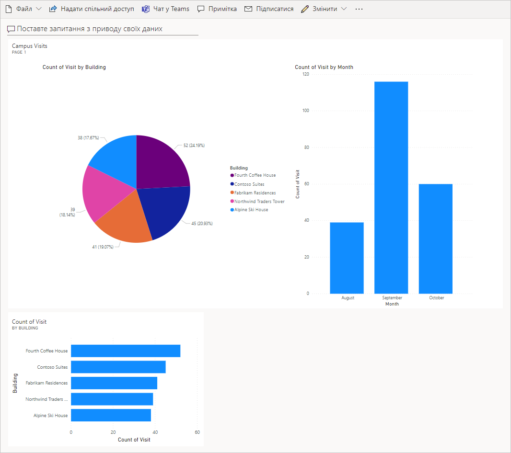

---
lab:
    title: 'Задание 7. Создание простой панели мониторинга'
    module: 'Модуль 5. Начало работы с Power BI'
---

# Модуль 5. Начало работы с Power BI
## Задание. Создание простой панели мониторинга

# Сценарий

Bellows College — образовательное учреждение, имеющее на территории своего кампуса несколько зданий. Сейчас для регистрации посетителей кампуса используются бумажные журналы. Информация собирается несогласованно, отсутствуют средства сбора и анализа данных о визитах по всему кампусу. 

Администрация кампуса хотела бы модернизировать систему регистрации посетителей таким образом, чтобы допуск в здания контролировали сотрудники службы безопасности, а обитатели кампуса предварительно регистрировали все визиты и обязательно записывали их.

В этом курсе обучения вы разработаете приложения и реализуете автоматические процедуры, позволяющие администрации и службе охраны Bellows College контролировать доступ в здания кампуса. 

В этом задании вы создадите панель мониторинга Power BI, показывающую данные о посещениях кампуса.

# Обзор этапов работы над высокоуровневым заданием

Этапы разработки и создания панели мониторинга Power BI

-   Подключение к базе данных Dataverse.
-   Преобразование данных для включения удобных описаний связанных строк (поиск).
-   Создание и публикация отчета с различными способами визуализации сведений о посещениях кампуса.
-   Применение пользовательского запроса на естественном языке для создания дополнительных вариантов визуализации.
-   Создание мобильного представления панели мониторинга Power BI.


## Предварительные требования

* Выполнить **задание 0 модуля 0 «Проверка лабораторной среды»**.
* Выполнить **задание 1 модуля 2 «Введение в Microsoft Dataverse»**.

## Что необходимо знать перед началом работы?

-   На какую аудиторию ориентирован отчет?
-   Как целевая аудитория будет просматривать отчет? На каком устройстве? Где?
-   Достаточно ли у вас данных для визуализации?
-   Какие характеристики можно использовать для анализа данных о посещениях?

# Упражнение 1. Создание отчета в Power BI 

**Цель упражнения.** В этом упражнении вы создадите отчет Power BI на основе данных из своей базы Dataverse.

## Задача 1. Установка Power BI Desktop и подготовка службы Power BI

1. Для установки Power BI выполните следующие инструкции. 

    - Если приложение Power BI Desktop **уже установлено**, перейдите к [задаче 2](#task-2-prepare-data).
    
    - Если приложение Power BI Desktop не установлено, выполните **шаг 2**.
    
    - Если у вас нет необходимых разрешений или есть проблемы с запуском Power BI Desktop, перейдите к **шагу 4**.

2. Чтобы загрузить приложение Power BI Desktop, откройте страницу [https://aka.ms/pbidesktopstore](https://aka.ms/pbidesktopstore).

    > [ВАЖНО!]
    > В случае проблем с установкой Power BI Desktop из Microsoft Store попробуйте автономный установщик, который можно загрузить со страницы [https://aka.ms/pbiSingleInstaller](https://aka.ms/pbiSingleInstaller).

3. Если вы успешно установили Power BI Desktop, то можно перейти к [задаче 2](#task-2-prepare-data). В противном случае перейдите к следующему шагу.

    > Если у вас нет необходимых разрешений для установки приложений на компьютер или возникают трудности с запуском или настройкой Power BI Desktop, выполните указанные ниже действия.

4. Загрузите [visits.pbix](../../Allfiles/visits.pbix) и сохраните на свой компьютер.

5. Перейдите по ссылке [https://app.powerbi.com/](https://app.powerbi.com/) и нажмите **Войти**. 

6. Нажмите **Моя рабочая область**. 

7. Если откроется страница **Получить данные**, нажмите **Пропустить**. 

8. Разверните раздел **+ Создать** и выберите **Отправить файл**.

    > [ВАЖНО!]
    > Если раздел **+ Создать** не отображается, возможно вам потребуется активировать новый интерфейс для Power BI. Переведите поле **Новый интерфейс** в верхней части экрана в положение **Вкл.**.

9. Выберите **Локальный файл**.

10. Найдите и выберите скачанный ранее файл **visit.pbix**.

11. По завершении загрузки данных выберите отчет **Визиты** (обратите внимание, что в поле «Тип» задано значение **Отчет**).

12. Нажмите **Правка**. Если пункт меню **Правка** не отображается, нажмите **…**, затем выберите **Правка**.

13. Теперь служба Power BI настроена для использования при выполнении заданий. Перейдите к [задаче 3](#task-3-create-chart-and-time-visualizations), но в задании вместо приложения Power BI Desktop используйте онлайн-службу Power BI по адресу [https://app.powerbi.com](https://app.powerbi.com).

## Задача 2. Подготовка данных

1.  Узнайте URL-адрес своей организации.

    * В новой вкладке откройте Центр администрирования Power Platform по адресу <https://admin.powerplatform.com>
    
    * На левой панели навигации выберите «Среды», затем откройте свою среду «Практика».
    
    * Щелкните правой кнопкой мыши **URL-адрес среды** на панели **Сведения**, затем выберите **Копировать адрес ссылки**.
    
2. Откройте Power BI Desktop и при появлении запроса войдите в систему с предоставленными учетными данными.

3. Выберите **Получить данные**.

4. Выберите **Power Platform** слева, затем выберите **Common Data Service** и нажмите **Подключить**.

5. Вставьте скопированный ранее URL-адрес среды в поле **URL-адрес сервера** и нажмите **OK**.

6. Разверните узел **Сущности**, выберите сущности **bc_Building** и **bc_Visit** и нажмите **Загрузить**.

7. Щелкните значок **Модель** на левой вертикальной панели инструментов.

8. Перетащите столбец **bc_buildingid** из таблицы **bc_Building** в столбец **bc_building** таблицы **bc_Visit**. В результате между двумя таблицами будет создана связь, с помощью которой Power BI сможет отображать связанные данные.

9. Выберите значок **Отчет** на левой панели инструментов.

10. Разверните узел **bc_Visit** на панели **Поля**.

11. Щелкните **…** рядом с **bc_Visit** и выберите **Создать столбец**.

12. Введите следующую формулу:

    ```
    Column = RELATED(bc_Building[bc_name])
    ```

    и нажмите клавишу ENTER. В результате в таблицу визитов добавится новое поле с названием здания.

13. Щелкните **…** рядом с вновь созданным полем **Столбец** и выберите **Переименовать**. Введите имя поля **Здание**.

14. Щелкните **…** рядом с полем **bc_visitid** и выберите **Переименовать**. Введите имя поля **Визит**.

15. Щелкните **…** рядом с полем **bc_scheduledstart** и выберите **Переименовать**. Введите имя поля **Начало**.

16. Для сохранения выполняемой работы выберите команду **Файл \| Сохранить** и введите произвольное имя файла.

## Задача 3. Создание диаграмм и визуализаций с привязкой ко времени

1. Чтобы вставить диаграмму, нажмите значок круговой диаграммы на панели **Визуализации**.

2. Перетащите поле **Здание** в поле **Условные обозначения**.

3. Перетащите поле **Визит** в целевое поле **Значения**.

4. Используя угловые маркеры, измените размер круговой диаграммы, чтобы были видны все ее компоненты.

5. Щелкните отчет за пределами круговой диаграммы, чтобы отменить ее выбор, и выберите гистограмму с накоплением в области **Визуализации**. 

6. Перетащите поле **Визит** в целевое поле **Значения**.

7. Перетащите поле **Начало** в целевое поле **Ось**.

8. В области «Визуализации» щелкните **X** рядом с полями **День** и **Квартал**, чтобы оставить для оси только итоговые значения **Год** и **Месяц**.

9. Используя угловые маркеры, измените размер диаграммы.

10. Протестируйте интерактивность отчета следующим образом.

    * Выделите на круговой диаграмме сегменты различных зданий и наблюдайте изменения в отчете по времени.
    
    * Щелкните гистограмму. Нажмите стрелку вниз, чтобы включить режим **Детализировать**, затем нажмите столбец для перехода к следующему уровню (месяцам). Также это можно сделать, нажав кнопку ленты **Данные и детализация \| Развернуть следующий уровень**.
    
    * Чтобы наблюдать изменения круговой диаграммы, переходите по уровням вверх и вниз, выбирая различные столбцы временной гистограммы.
    
11. Для сохранения выполняемой работы выберите команду **Файл \| Сохранить**.

# Упражнение 2. Создание панели мониторинга в Power BI

## Задача 1. Публикация отчета в Power BI

1. На вкладке «Главная» нажмите кнопку **Опубликовать**.

2. В качестве места назначения выберите **Моя рабочая область**, затем нажмите **Выбрать**.

3. Дождитесь завершения публикации и нажмите **Открыть \<имя вашего отчета\>.pbix в Power BI**.

## Задача 2. Создание панели мониторинга в Power BI

1. У вас должен быть открыт отчет из предыдущей задачи.

2. В меню выберите **Закрепить на панели мониторинга**. В зависимости от макета может потребоваться нажать **…**, чтобы отобразить дополнительные элементы меню.

3. В ответ на подсказку **Закрепить на панели мониторинга** ведите **Новая панель мониторинга**.

4. В поле **Имя панели мониторинга** введите **[Ваша фамилия]: управление кампусом** и нажмите **Закрепить живую плитку**.

5. Выберите в верхней части экрана **Моя рабочая область**, затем выберите панель мониторинга **[Ваша фамилия]: управление кампусом**.

6. Протестируйте интерактивность отображаемых круговых и линейчатых диаграмм.

## Задача 3. Добавление визуализаций с использованием естественного языка

1. В верхней части панели мониторинга **Управление кампусом** выберите поле **Задать вопрос о своих данных**.

2. В области вопросов и ответов введите строку **здания по количеству визитов**. Отобразится гистограмма.

3. Выберите **Закрепить визуальный элемент**.

4. Выберите вариант **Существующая панель мониторинга**, затем выберите свою панель мониторинга **[Ваша фамилия]: управление кампусом** и нажмите **Закрепить**.

5. Нажмите **Выйти из раздела вопросов и ответов**.

Должна отобразиться панель мониторинга **[Ваша фамилия]: управление кампусом**. Возможно, потребуется прокрутить экран вниз, чтобы отобразился новый визуальный элемент «Вопросы и ответы». 

Ваша панель мониторинга должна выглядеть примерно так:



## Задача 4. Создание мобильного представления и доступ к отчету с помощью QR-кода

1. На панели мониторинга выберите **Правка \| Мобильное представление**.

2. Измените расположение плиток по своему усмотрению.

3. Щелкните **Представление телефона** в правом верхнем углу и выберите **Веб-представление**.

4. Выберите в верхней части экрана **Моя рабочая область**, затем выберите свой **отчет**.

5. Выберите **Правка**, затем выберите **… \| Создать QR-код**.

6. *Необязательно:* если у вас есть мобильное устройство, отсканируйте код с помощью приложения для сканирования QR-кодов, доступного на платформах iOS и Android, или приложения камеры, если ваш телефон поддерживает его. Войдите в систему со своей учетной записью, если появится такой запрос. Перейдите к отчету и изучите его на мобильном устройстве.

# Задачи повышенной сложности

* Включите в панель мониторинга и в отчеты планы своего кампуса и зданий.
* Составляйте отчеты о визитах и анализируйте распределение и тенденции визитов.
* Визуализация превышения срока визита.
* Потоковая передача Power BI для обработки данных большого кампуса почти в реальном времени. 
